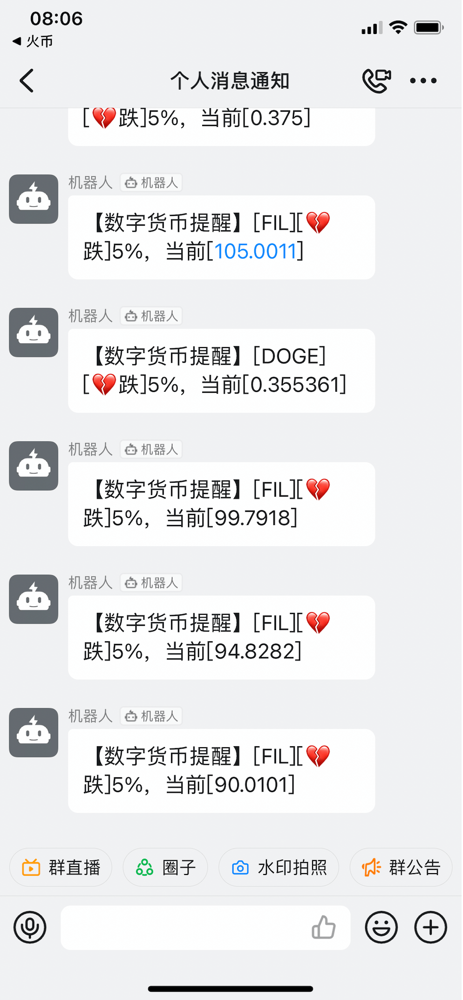

# 火币K线数据监控

监控目标交易对，到达设置的涨跌幅度，发送钉钉推送。

运行前先修改`src/Constants.ts`中的参数


## 安装依赖包

```bash
npm install
```

## 使用docker安装redis
```bash
docker run -d --name redis -p 6379:6379 redis --requirepass '123.com'
```

## 本地运行

```bash
npm start
```

## 后台运行

```bash
npm install -g forever
npm run forever-start
```

## 效果


